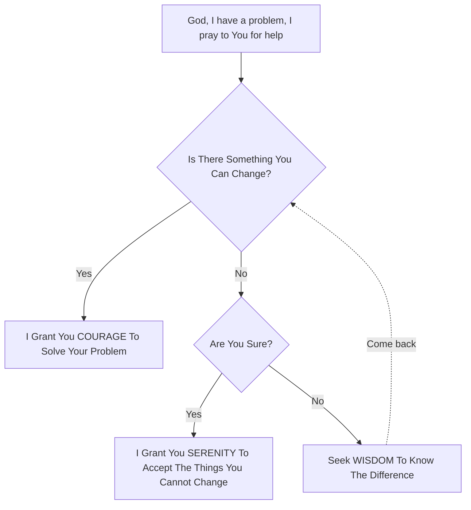

Simulates God's decision tree



## Install

```bash
git clone https://github.com/kuprel/serenity
cd serenity
chmod +x helpgod
```

## Usage

```bash
> ./helpgod
Is There Something You Can Change? (yes/no) yes
I Grant You COURAGE To Solve Your Problem
```

```bash
> ./helpgod
Is There Something You Can Change? (yes/no) no
Are You Sure? (yes/no) yes
I Grant You SERENITY To Accept The Things You Cannot Change
```

```bash
> ./helpgod
Is There Something You Can Change? (yes/no) no
Are You Sure? (yes/no) no
Seek WISDOM To Know The Difference Then Come Back
Is There Something You Can Change? (yes/no) yes
I Grant You COURAGE To Solve Your Problem
```
